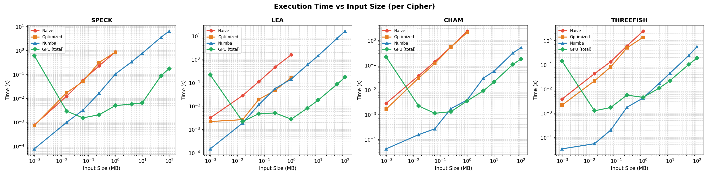
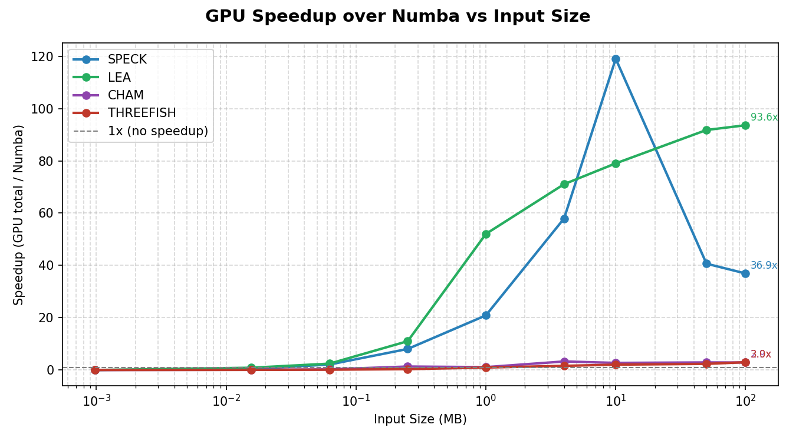
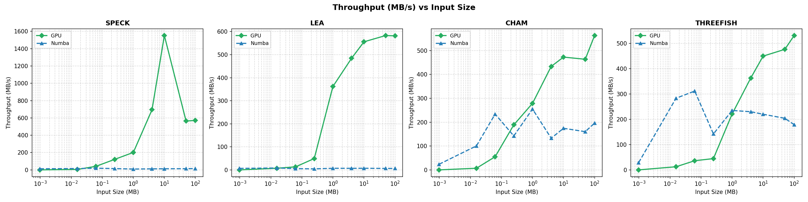
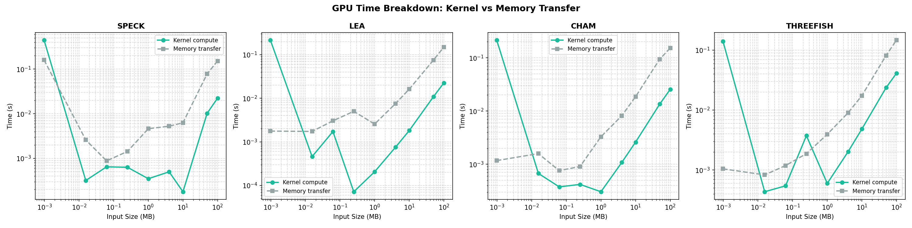
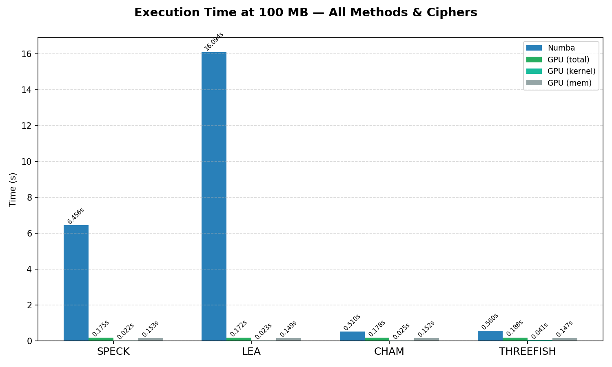

# GPU-Accelerated ARX & Permutation-Based Ciphers: Performance Analysis Report

## Hardware Specifications

- **CPU:** Intel Ultra 7 155H
- **GPU:** NVIDIA GeForce RTX 4060 Laptop GPU[65W TDP,8gb]
- **RAM:** 16 GB
- **Architecture:** x86_64
- **OS:** Windows 11
- **Cuda Toolkit version:** 11.8

## 1. Introduction

This project implements and benchmarks four symmetric ciphers — three based on the **ARX (Add–Rotate–XOR)** paradigm and one based on a **permutation** design — across four progressively optimized execution backends:

| # | Cipher | Family | Block Size | Key Size | Rounds | Word Size |
|---|--------|--------|------------|----------|--------|-----------|
| 1 | **SPECK 128/128** | ARX (Feistel) | 128-bit | 128-bit | 32 | 64-bit |
| 2 | **LEA-128** | ARX (GFN) | 128-bit | 128-bit | 24 | 32-bit |
| 3 | **CHAM-128/128** | ARX (GFN) | 128-bit | 128-bit | 80 | 32-bit |
| 4 | **Threefish-256** | ARX (substitution–permutation) | 256-bit | 256-bit | 72 | 64-bit |


### 1.1 Motivation

ARX ciphers are designed to be efficient in software — they avoid S-boxes and rely entirely on modular addition, bitwise rotation, and XOR. This makes them natural candidates for **massive parallelism on GPUs**, where thousands of independent blocks can be encrypted simultaneously. This project quantifies exactly how much speedup GPU acceleration provides over CPU-based approaches.

### 1.2 Implementation Tiers

Each cipher is implemented in four variants:

| Tier | File Suffix | Description |
|------|-------------|-------------|
| **Naive** | `_naive.py` | Pure Python, block-by-block loop. Serves as the correctness reference. |
| **Optimized** | `_optimized.py` | Pure Python with structural improvements (pre-parsed blocks, list-based batch processing). |
| **Numba JIT** | `_numba.py` | NumPy arrays + `@njit` compiled loops. Single-threaded native code via LLVM. |
| **CUDA GPU** | `_gpu.py` | Numba CUDA kernels with shared memory for round keys, grid-stride loops, and CUDA event timing. |

---

## 2. Cipher Descriptions

### 2.1 SPECK 128/128

SPECK is an NSA-designed lightweight block cipher from the SIMON & SPECK family. It uses a simple Feistel-like structure:

```
Encryption round:  x = (ROR(x, 8) + y) ⊕ k
                   y = ROL(y, 3) ⊕ x
```

- **Block:** 2 × 64-bit words (128-bit total)
- **Rounds:** 32
- **Key schedule:** Iterative, using the same ARX round function
- **Mode:** ECB

### 2.2 LEA-128

LEA (Lightweight Encryption Algorithm) is a South Korean standard (KS X 3246). It uses a **Generalized Feistel Network** (GFN) with 4 branches:

```
Encryption round:  x0 = ROL((x0 ⊕ k0) + (x1 ⊕ k1), 9)
                   x1 = ROR((x1 ⊕ k2) + (x2 ⊕ k3), 5)
                   x2 = ROR((x2 ⊕ k4) + (x3 ⊕ k5), 3)
                   x3 = x0_prev
```

- **Block:** 4 × 32-bit words (128-bit total)
- **Rounds:** 24
- **Key schedule:** Uses four rotation constants δ
- **Mode:** ECB

### 2.3 CHAM-128/128

CHAM is a lightweight ARX cipher designed for resource-constrained environments. It features:

```
Even round: t = ROL(x0, 1) ⊕ x2 ⊕ ((x1 + rk[i%16]) mod 2³²)
Odd round:  t = ROL(x0, 8) ⊕ x2 ⊕ ((x1 + rk[i%16]) mod 2³²)
            Rotate state: (x0,x1,x2,x3) ← (x1,x2,x3,t)
```

- **Block:** 4 × 32-bit words (128-bit total)
- **Rounds:** 80
- **Key schedule:** Compact — only 16 round keys derived from 4 key words
- **Mode:** ECB with PKCS7 padding

### 2.4 Threefish-256

Threefish is the underlying block cipher of the Skein hash function (SHA-3 finalist). It is a pure ARX cipher with no S-boxes:

```
Mix function: x0 = x0 + x1;  x1 = ROL(x1, r) ⊕ x0
```

- **Block:** 4 × 64-bit words (256-bit total)
- **Rounds:** 72
- **Key schedule:** Subkey injection every 4 rounds using a key-dependent schedule with constant C₂₄₀
- **Mode:** ECB with padding

---

## 3. GPU Implementation Details

All GPU implementations share a common architecture optimized for throughput:

### 3.1 Kernel Design

```python
@cuda.jit
def cipher_kernel(blocks, out, round_keys, decrypt):
    # Load round keys into shared memory (fast on-chip SRAM)
    shared_keys = cuda.shared.array(N_ROUNDS, dtype=np.uint64)
    tid = cuda.threadIdx.x
    if tid < N_ROUNDS:
        shared_keys[tid] = round_keys[tid]
    cuda.syncthreads()

    # Grid-stride loop for arbitrary input sizes
    i = cuda.grid(1)
    stride = cuda.gridsize(1)
    for j in range(i, blocks.shape[0], stride):
        # ... encrypt/decrypt block j ...
```

**Key optimizations:**
- **Shared memory** for round keys — avoids repeated global memory reads
- **Grid-stride loops** — each thread processes multiple blocks, enabling efficient handling of inputs larger than the grid
- **256 threads per block** — balances occupancy and register pressure
- **CUDA event timing** — precise measurement of kernel execution vs. memory transfer

### 3.2 Benchmarking Methodology

Timing is carefully decomposed into three components:

| Component | Measurement Method |
|-----------|-------------------|
| **Host→Device transfer** | `time.perf_counter()` around `cuda.to_device()` |
| **Kernel execution** | CUDA events (`cuda.event_elapsed_time()`) |
| **Device→Host transfer** | `time.perf_counter()` around `copy_to_host()` |

**Total GPU time = H2D + Kernel + D2H**

### 3.3 Benchmark Parameters

| Parameter | SPECK | LEA | CHAM | Threefish |
|-----------|-------|-----|------|-----------|
| **Key Size** | 128-bit (16 bytes) | 128-bit (16 bytes) | 128-bit (16 bytes) | 256-bit (32 bytes) |
| **Key Value** | `bytes(range(16))` | `bytes(range(16))` | `bytes(range(16))` | `bytes(range(32))` |
| **Plaintext** | `b'A' * size` | `b'A' * size` | `b'A' * size` | `b'A' * size` |
| **Block Size** | 128-bit (16 bytes) | 128-bit (16 bytes) | 128-bit (16 bytes) | 256-bit (32 bytes) |

**Plaintext sizes tested:**

| # | Size (bytes) | Size (human) |
|---|-------------|-------------|
| 1 | 1,024 | 1 KB |
| 2 | 16,384 | 16 KB |
| 3 | 65,536 | 64 KB |
| 4 | 262,144 | 256 KB |
| 5 | 1,048,576 | 1 MB |
| 6 | 4,194,304 | 4 MB |
| 7 | 10,485,760 | 10 MB |
| 8 | 52,428,800 | 50 MB |
| 9 | 104,857,600 | 100 MB |

For sizes ≤ 1 MB, all four implementations (Naive, Optimized, Numba, GPU) are benchmarked. For larger sizes, Naive and Optimized are skipped (too slow).

---

## 4. Results

### 4.1 Execution Time vs. Input Size



**Key observations:**

- **Naive and Optimized** implementations scale linearly and are 2–3 orders of magnitude slower than JIT/GPU approaches at 1 MB
- **Numba JIT** provides significant speedup over pure Python (10–100×) but remains single-threaded
- **GPU** execution time grows very slowly with input size, dominated by memory transfer overhead at smaller sizes

### 4.2 GPU Speedup over Numba



| Cipher | Speedup @ 1 MB | Speedup @ 10 MB | Speedup @ 100 MB |
|--------|---------------|-----------------|------------------|
| **SPECK** | 20.88× | 119.04× | 36.91× |
| **LEA** | 52.04× | 79.03× | 93.61× |
| **CHAM** | 1.09× | 2.71× | 2.87× |
| **THREEFISH** | 0.94× | 2.04× | 2.97× |

**Analysis:**

- **LEA achieves the highest GPU speedup** (93.6× at 100 MB), because its Numba implementation is relatively slow (~6 MB/s) while the GPU kernel executes very efficiently
- **SPECK peaks at 119× speedup at 10 MB** but drops at larger sizes due to memory transfer overhead dominating
- **CHAM and Threefish show modest GPU speedups** (2–3×). CHAM's 80 rounds create heavier kernel compute, and Threefish's Numba implementation is already very fast (~200 MB/s), leaving less room for GPU improvement

### 4.3 Throughput Comparison (GPU vs. Numba)



| Cipher | GPU Throughput @ 100 MB | Numba Throughput @ 100 MB |
|--------|------------------------|--------------------------|
| **SPECK** | 571.67 MB/s | 15.49 MB/s |
| **LEA** | 581.65 MB/s | 6.21 MB/s |
| **CHAM** | 563.10 MB/s | 196.16 MB/s |
| **THREEFISH** | 530.83 MB/s | 178.73 MB/s |

**Key insight:** All ciphers converge to roughly **530–580 MB/s GPU throughput** at large sizes. This suggests the GPU is **memory-transfer-bound**, not compute-bound — the PCIe bus becomes the bottleneck regardless of cipher complexity.

### 4.4 GPU Time Breakdown: Kernel vs. Memory Transfer



At 100 MB, memory transfer dominates GPU total time across all ciphers:

| Cipher | Kernel Time | Memory Transfer | Kernel % |
|--------|------------|-----------------|----------|
| **SPECK** | 0.0224 s | 0.1526 s | 12.8% |
| **LEA** | 0.0225 s | 0.1494 s | 13.1% |
| **CHAM** | 0.0255 s | 0.1521 s | 14.3% |
| **THREEFISH** | 0.0412 s | 0.1472 s | 21.9% |

> Memory transfer accounts for **78–87%** of total GPU time. The kernel compute itself is extremely fast — the bottleneck is moving data across the PCIe bus.

### 4.5 Execution Time at 100 MB — All Methods



This chart shows the dramatic differences at scale:

| Cipher | Numba (s) | GPU Total (s) | GPU Kernel (s) | GPU Memory (s) |
|--------|-----------|---------------|----------------|----------------|
| **SPECK** | 6.456 | 0.175 | 0.022 | 0.153 |
| **LEA** | 16.094 | 0.172 | 0.023 | 0.149 |
| **CHAM** | 0.510 | 0.178 | 0.025 | 0.152 |
| **THREEFISH** | 0.560 | 0.188 | 0.041 | 0.147 |

- **LEA Numba** is the slowest CPU implementation (16s), making GPU acceleration particularly impactful
- **CHAM and Threefish Numba** are already fast (~0.5s), so the GPU advantage is marginal
- **GPU kernel times** are remarkably similar across all ciphers (0.022–0.041s), confirming that the GPU has massive compute headroom

---

## 5. Discussion

### 5.1 Why Does Speedup Vary So Much?

The GPU speedup is a ratio: **Speedup = T_numba / T_gpu_total**

Since GPU total time is dominated by memory transfer (~0.15s for all ciphers at 100 MB), ciphers with **slower Numba implementations** see proportionally higher speedups:

- LEA Numba: 16s → **93.6× speedup**
- SPECK Numba: 6.5s → **36.9× speedup**
- CHAM Numba: 0.5s → **2.9× speedup**

### 5.2 Why Do CHAM and Threefish Have Fast Numba Code?

- **CHAM** uses 32-bit words with simple in-place rotation — Numba compiles this to highly efficient native x86 instructions
- **Threefish** also uses simple add-rotate-XOR on 64-bit words, which maps well to 64-bit CPU registers

In contrast, **LEA** has a more complex round structure with 6 sub-keys per round and multiple interdependent operations, which Numba cannot vectorize as effectively.

### 5.3 Memory Transfer Bottleneck

At 100 MB, memory transfer time is nearly identical across all ciphers (~0.15s). This is determined by the **PCIe bandwidth** between CPU and GPU, not the cipher. To further improve GPU performance, one could:

1. **Use pinned (page-locked) memory** for faster DMA transfers
2. **Overlap transfer and compute** with CUDA streams
3. **Process data in-place on GPU** (avoid round-trip if data originates on GPU)
4. **Use CTR mode** where the keystream is generated entirely on-GPU

### 5.4 Speedup Drop at Large Sizes (SPECK)

SPECK's speedup peaks at 10 MB (119×) but drops to 37× at 100 MB. This is because:
- At 10 MB, the kernel is extremely fast (0.18ms) and memory transfer is still moderate (~6ms)
- At 100 MB, memory transfer grows to 153ms while the kernel grows to only 22ms
- The ratio **kernel/transfer** becomes increasingly unfavorable

---

## 6. Project Structure

```
ARX_Permutation_based/
├── SPECK/
│   ├── speck_naive.py          # Pure Python reference
│   ├── speck_optimized.py      # Batch-processed Python
│   ├── speck_numba.py          # Numba JIT (CPU)
│   ├── speck_gpu.py            # CUDA kernel
│   ├── benchmark_speck.py      # Benchmarking harness
│   └── test_speck.py           # Correctness tests
├── LEA/                        # Same structure
├── CHAM/                       # Same structure
├── THREEFISH/                  # Same structure
├── Plots/
│   ├── time_vs_size.png
│   ├── speedup.png
│   ├── throughput.png
│   ├── gpu_breakdown.png
│   └── bar_100mb.png
├── main.py                     # Entry point: runs benchmarks & generates plots
├── output.txt                  # Sample benchmark output
├── requirements.txt            # Dependencies
└── report.md                   # This report
```

---

## 7. How to Run

### Prerequisites

- Python 3.8+
- NVIDIA GPU with CUDA toolkit (v11.8 tested)
- Numba with CUDA support

### Installation

```bash
pip install -r requirements.txt
```

### Running Benchmarks

```bash
python main.py
```

This will:
1. Run all four ciphers across 9 input sizes
2. Print detailed timing results to console
3. Generate 5 plots and save as PNG files

### Running Tests

Uncomment the relevant test calls in `main.py`:
```python
test_speck_consistency()    # Verifies encrypt→decrypt round-trip
test_lea_consistency()
test_cham_consistency()
test_threefish_consistency()
```

---

## 8. Conclusions

1. **GPU acceleration is highly effective for ARX ciphers**, achieving up to **119× speedup** over JIT-compiled CPU code (SPECK at 10 MB) and **93× sustained speedup** (LEA at 100 MB).

2. **All ciphers converge to ~550 MB/s GPU throughput**, revealing that performance is **PCIe memory-transfer-bound**, not compute-bound. The GPU kernels themselves are 5–8× faster than indicated by total GPU time.

3. **The benefit of GPU acceleration depends on the baseline CPU speed.** Ciphers with complex round structures (LEA) benefit most, while those with simple round functions that Numba optimizes well (CHAM, Threefish) see more modest gains.

4. **Shared memory optimization** for round keys is critical — without it, each thread would repeatedly fetch keys from slow global memory.

5. **Future work** could explore CUDA streams for overlapped transfer/compute, pinned memory allocation, and CTR/stream modes that avoid the full data round-trip.

---

